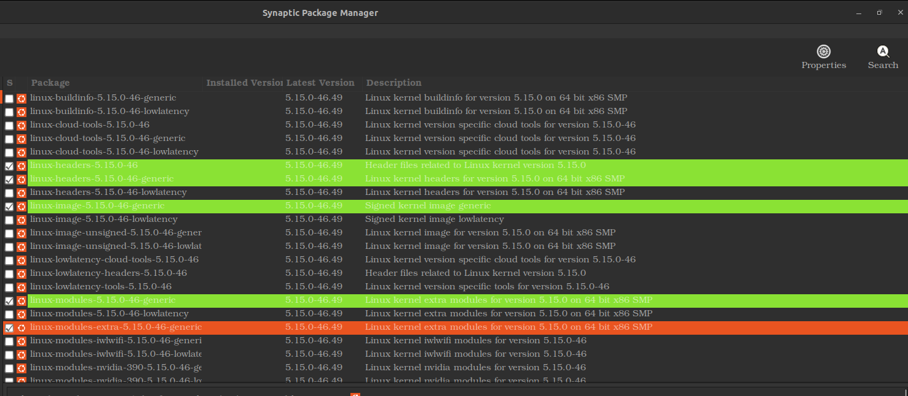

<div align=center>
<a href="https://freeimage.host/"></a>
<h1>Solo Mining with AMD (Ubuntu 20.04)<h1>
</div>

If your rig runs AMD GPUs, you will need to use Wildrig miner, which is currently the only one that works with AMD. With Wildrig, however, direct solo mining isn't possible. So we'll thus be mining through Newpool, which has a solo mining option.[^1]

## Step 1: AMD Driver Installation

Since Ubuntu doesn't come with AMD's OpenCL driver, which is necessary for mining, you'll need to install that. 

Installation of this driver, however, is an sure headache for almost anyone except the most advanced Linux user. Neither AMD's documentation nor their software is up to date with current Ubuntu distros.

In order to successfully begin mining with an AMD GPU, one must not only use older driver software (22.20), but also run Linux kernel 5.15.0-46 ****with no other installed kernels****. Amdgpu-dkms attempts to install on all kernels; but since it is not compatible with them all, it fails on a single kernal, thus haulting the entire install process.[^2]

1. So let's begin by switching kernels. The easiest way to do this is with the Synaptic Package Manager. Synaptic, however, doesn't come installed on Ubuntu 20.04, so unless you have already installed it, give:
   
   ```
   sudo apt update
   ```
   
   ```
   sudo apt upgrade
   ```
   
   ```
   sudo apt install synaptic
   ```

2. Now open Synaptic and click on search. Search for "linux 5.15.0-46". You should see a screen like the following:
   
   <div>
   
   </div>
   
   <div>
   <a href="https://github.com/Eumaios1212/Zano-Solo-Mining-Guide/blob/add-res/images/amd-kernel_selection.png"a>
   </div>
   
   In the above image, five packages are marked for installation:
   
   ****linux-headers-5.15.0-46****
   
   ****linux-headers-5.15.0-46-generic****
   
   ****linux-image-5.15.0-46-generic****
   
   ****linux-modules-5.15.0-46-generic****
   
   ****linux-modules-extra-5.15.0-46-generic****
   
   Click "Apply." This should install the kernel and all needed dependencies.

3. To use this kernal, we need to shut down and reboot into grub. While rebooting, tap the ****del**** key until you enter the grub screen:
   
   <div>
   
   </div>
   
   Select "Advanced options for Ubuntu". Then select the kernel version we just installed: 
   
   ****Linux 5.15.0-46-generic**** [note: not (recovery mode)]:
   
   <div>
    
    </div>

4. After reboot, return to Synaptic. We need to hunt down all other Kernals, as well as any associated dependencies, i.e., all images, headers, modules, and modules-extras. Search for: "****5.15.0-****". Results will show all possible kernels and dependencies, including those with a green box that are currently installed on your machine:
   
   <div>
   
   </div>
   
   Go through the list, marking for removal all installed kernels and their dependencies other than kernel ****5.15.0-46**** and its dependencies. Note: ****it is extremely important that you not also remove kernel 46! Doing so will fatally crash your rig.**** To be safe, after you've determined which kernels are installed on your machine, do a search delimiting it to one particular kernel at a time, e.g., 5.15.0-43, then 5.15.0-58, etc.
   
   Apply your changes and close Synaptic. Lastly, just to be sure that you've removed all unneeded dependencies, give:
   
   ```
   sudo apt autoremove
   ```
   
   ```
   sudo reboot
   ```

5. Now that we have the proper kernel installed, and all others removed, we can download and install the AMD driver installer. Go to your Downloads directory and give the command:
   
   ```
   wget http://repo.radeon.com/amdgpu-install/22.20/ubuntu/focal/amdgpu-install_22.20.50200-1_all.deb
   ```
   
   Now install it:
   
   ```
   sudo apt install ./amdgpu-install_22.20.50200-1_all.deb
   ```

6. If successful, install the driver itself:
   
   ```
   amdgpu-install --opencl=legacy,rocr --usecase=workstation,graphics --no-32
   ```
   
   ```
   sudo reboot
   ```

7. To determine whether the driver was properly installed, we need the application ****clinfo****. So let's install that and reboot:
   
   ```
   sudo apt install clinfo
   ```
   
   Now let's check for our GPU:[^3]
   
   ```
   sudo clinfo
   ```
   
   You should see something like the following, with OpenCL under both "Platform version" and "Device version."
   
   <div>
   
   </div>

## Step 2: Installing & Running Wildrig Miner

Create a directory for Wildrig within your main Zano directory:

```
mkdir wildrig
```

Within it, download Wildrig:

```
wget https://github.com/andru-kun/wildrig-multi/releases/download/0.36.6b/wildrig-multi-linux-0.36.6b.tar.xz
```

Extract the .tar file:

```
tar -xf wildrig-multi-linux-0.36.6b.tar.xz
```

Remove the original .tar file:

```
rm wildrig-multi-linux-0.36.6b.tar.xz
```

You're ready to begin mining. Give the following command in your Wildrig directory, substituting your own address for "wallet address":[^4]

```
sudo ./wildrig-multi --print-full --algo progpowz -o stratum+tcp://minenice.newpool.pw:1287 -u solo:wallet_address.ZanoSolo -p x
```

The miner should start, displaying something like this:

<div>

</div>

Now go to https://newpool.pw/zano/#worker_stats and enter your wallet address; you should see your miner stats:

<div>

</div>

<div>
<div align=center>
<h1>Congratulations, you're solo mining Zano!<h1>
</div>

[^1]: Be aware that Newpool has a 1.0% pool fee.

[^2]: In testing out various kernels, I found that 46 worked on bare metal, but I could not replicate that success in a VM. The VM required kernel 43. You may have to play around with various kernels. If 46 doesn't work for you, try 43. YOu will know you need to switch kernel, if your installation fails with the following error:

`Building initial module for 5.15.0-58-generic`

`Error! Bad return status for module build on kernel: 5.15.0-58-generic (x86_64)`

[^3]: If you don't include `sudo` in this command, it's likely that your GPU will not be displayed under devices.

[^4]: Note again the need to give `sudo` here. Also, the port 1287 is used here, which is for high end graphics cards such as RX 470, 480, 570, 580, VEGA 56/64 and better. Port 1157 should be used for mid- and low-grade GPUs such as RX 460, 550, and 560.
