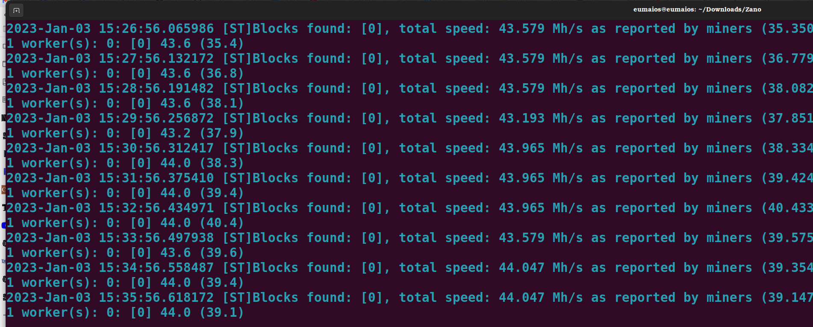

<div align=center>

<h1>Solo Mining with AMD (Ubuntu)<h1>
</div>

## Step 1: Synchronize the Daemon

Open a terminal in the directory with `zanod`, and run it: [^1]

```
./zanod
```

Allow the daemon to synchronize, while we complete other steps.

## Step 2: Install Wildrig Miner[^2]

Open another terminal within the same directory. Create a new directory for Wildrig and enter it:

```
mkdir wildrig
cd wildrig
```

Within wildrig directory, give the following command to download the miner:

```
wget https://github.com/andru-kun/wildrig-multi/releases/download/0.36.6b/wildrig-multi-linux-0.36.6b.tar.xz
```

Extract and then remove the original .tar file:

```
tar -xf wildrig-multi-linux-0.36.6b.tar.xz
rm wildrig-multi-linux-0.36.6b.tar.xz
```

Leave this directory open; we'll return to it soon.

## Step 3: AMD Driver Installation

Since Ubuntu doesn't come with AMD's OpenCL driver, which is necessary for mining, you'll need to install that. But it also requires ****very**** specific AMD driver software (22.40): we've found no other that successfully installs. 

1. First, we must get the driver installer itself. Go to your Downloads directory and give the following commands:
   
   ```
   sudo apt update
   sudo apt upgrade
   ```
   
   a) If running Ubuntu 20.04 LTS:
   
   ```
   wget https://repo.radeon.com/amdgpu-install/22.40/ubuntu/focal/amdgpu-install_5.4.50401-1_all.deb
   ```
   
   b) If running Ubuntu 22.04 LTS or 22.10:
   
   ```
   wget https://repo.radeon.com/amdgpu-install/22.40/ubuntu/jammy/amdgpu-install_5.4.50401-1_all.deb
   ```
   
   Now, if you already have any AMD drivers installed ****other than 22.40****, you'll need a few extra steps, provided in the following footenote [^3]. 
   
   If there are no other AMD drivers on your rig, proceed to install the driver installer and enable the proprietary repository: 
   
   ```
   sudo apt install ./amdgpu-install_5.4.50401-1_all.deb
   sudo sed -i 's/#deb/deb/g' /etc/apt/sources.list.d/amdgpu-proprietary.list  
   ```

2. If everything went smoothly, the driver can now be installed:
   
   ```
   amdgpu-install --opencl=legacy,rocr --usecase=workstation,graphics --no-32
   ```
   
   If successful, reboot:
   
   ```
   sudo reboot
   ```

3. To determine whether the driver was properly installed, we need the application ****clinfo****. Install that, and then check for your GPU: [^4]
   
   ```
   sudo apt install clinfo
   sudo clinfo
   ```
   
   You should see something like the following, with OpenCL under both "Platform version" and "Device version."
   
   <div>
   
   </div>

## Step 4: Starting Wildrig Miner

Once your node is fully synced, stop it (ctl+c). In the same terminal, restart `zanod` with the following flags, substituting your wallet address for        "<YOUR_WALLET_ADDRESS>"

```
./zanod --stratum --stratum-bind-port=11555 --stratum-miner-address=<YOUR_WALLET_ID>
```

The daemon should start, displaying this screen. 


You're ready to begin mining. 

Return to your wildrig directory and run Wildrig, again substituting your wallet address for "<YOUR_WALLET_ID>" :[^5]

```
cd wildrig
sudo ./wildrig-multi --print-full --algo progpowz --protocol ethproxy -u <YOUR_WALLET_ID> -o 127.0.0.1:11555 -w worker1 -p x
```

The miner should start, displaying your statistics:

<div>

</div>

And if you switch to the terminal with your daemon running, you should now see this:



<div>
<h1>Congratulations, you're solo mining Zano!<h1>
</div>

[^1]: This guide assumes you have already installed, and can use, a CLI wallet and its daemon. If you haven't, see those guides [here](https://docs.zano.org/docs/install-a-zano-cli-wallet-ubuntu) and [here](https://docs.zano.org/docs/using-a-zano-cli-wallet), respectively.

[^2]: Be aware that Wildrig has a 1.0% fee.

[^3]: If you already have any AMD driver installed other than 22.40, you'll need to here take the following steps. Uninstall driver: `amdgpu-install --uninstall`. Install the debian package (i.e., what would have been your next step above): `sudo apt install ./amdgpu-install_5.4.50401-1_all.deb`. Give: `sudo apt update` & `sudo apt autoremove`. You can now proceed to enabling the AMD proprietary repository. 

[^4]: If you don't include `sudo` in this command, it's likely that your GPU will not be displayed under devices.

[^5]: Note again the need to give `sudo` here.
