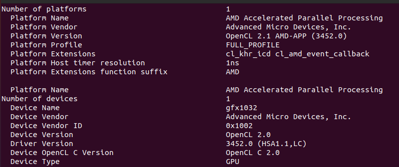
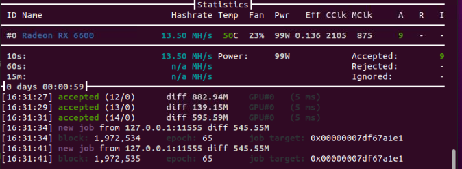

<div align=center>
<a href="https://freeimage.host/"></a>
<h1>Solo Mining with AMD (Ubuntu)<h1>
</div>

If your rig runs AMD GPUs, you will need to use Wildrig miner, which is currently the only one that works with AMD. With Wildrig, however, direct solo mining isn't possible. So we'll thus be mining through Newpool, which has a solo mining option.[^1]

## Step 1: AMD Driver Installation

Since Ubuntu doesn't come with AMD's OpenCL driver, which is necessary for mining, you'll need to install that. 

In order to successfully begin mining with an AMD GPU, one must use very specific driver software (AMD 22.40).

1. First, we must get the driver installer itself. Go to your Downloads directory and give the following commands:
   
   ```
   sudo apt update
   ```
   
   ```
   sudo apt upgrade
   ```
   
   ```
   wget http://repo.radeon.com/amdgpu-install/22.20/ubuntu/focal/amdgpu-install_22.20.50200-1_all.deb
   ```
   
   ```
   sudo apt install ./amdgpu-install_22.20.50200-1_all.deb
   ```

2. If successful, the driver can now be installed:
   
   ```
   amdgpu-install --opencl=legacy,rocr --usecase=workstation,graphics --no-32
   ```
   
   ```
   sudo reboot
   ```

3. To determine whether the driver was properly installed, we need the application ****clinfo****:
   
   ```
   sudo apt install clinfo
   ```
   
   Check for your GPU: [^2]
   
   ```
   sudo clinfo
   ```
   
   You should see something like the following, with OpenCL under both "Platform version" and "Device version."
   
   <div>
   
   </div>

## Step 2: Installing & Running Wildrig Miner

Create a directory for Wildrig within your main Zano directory:

```
mkdir wildrig
```

Within it, download Wildrig:

```
wget https://github.com/andru-kun/wildrig-multi/releases/download/0.36.6b/wildrig-multi-linux-0.36.6b.tar.xz
```

Extract the .tar file:

```
tar -xf wildrig-multi-linux-0.36.6b.tar.xz
```

Remove the original .tar file:

```
rm wildrig-multi-linux-0.36.6b.tar.xz
```

You're ready to begin mining. Give the following command in your Wildrig directory, substituting your own address for "wallet address":[^3]

```
sudo ./wildrig-multi --print-full --algo progpowz -o stratum+tcp://minenice.newpool.pw:1287 -u solo:wallet_address.ZanoSolo -p x
```

The miner should start, displaying something like this:

<div>

</div>

Now go to https://newpool.pw/zano/#worker_stats and enter your wallet address; you should see your miner stats:

<div>

</div>

<div>
<div align=center>
<h1>Congratulations, you're solo mining Zano!<h1>
</div>

[^1]: Be aware that Newpool has a 1.0% pool fee.

[^2]: If you don't include `sudo` in this command, it's likely that your GPU will not be displayed under devices.

[^4]: Note again the need to give `sudo` here. Also, the port 1287 is used here, which is for high end graphics cards such as RX 470, 480, 570, 580, VEGA 56/64 and better. Port 1157 should be used for mid- and low-grade GPUs such as RX 460, 550, and 560.
