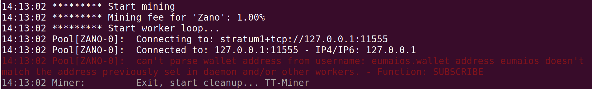
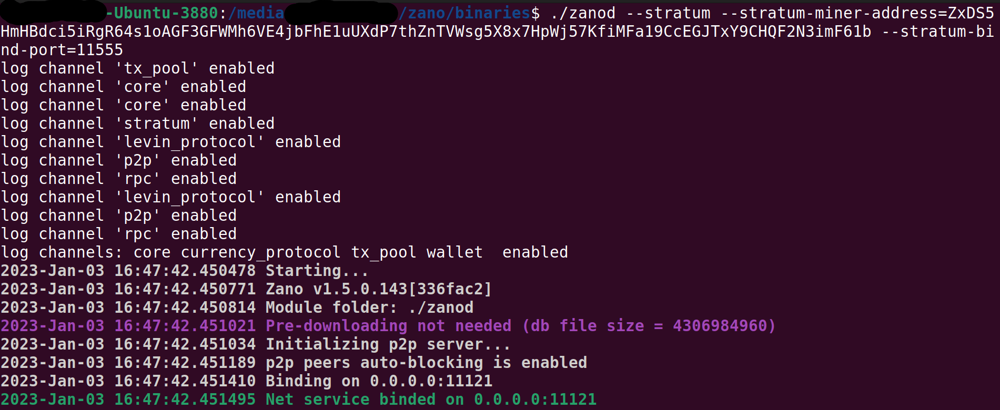
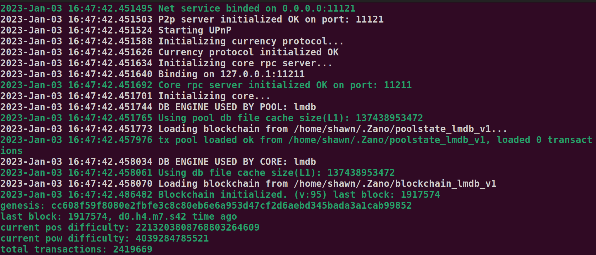
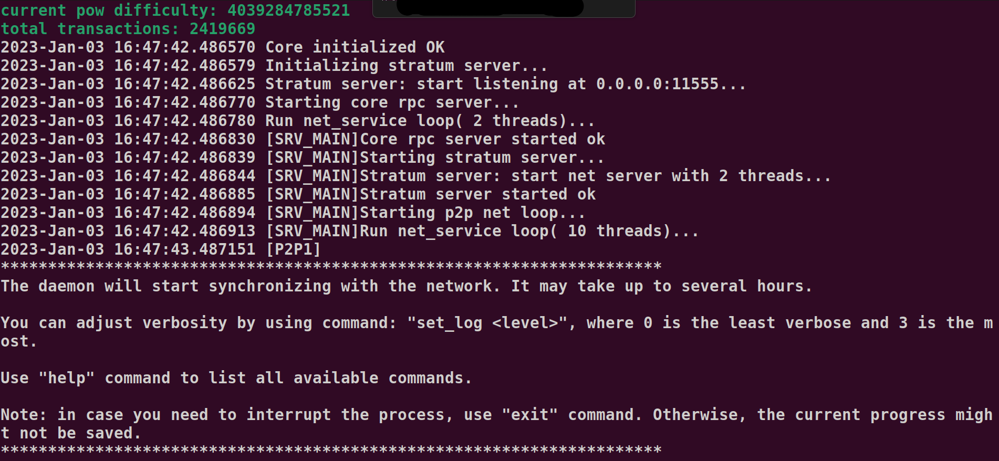
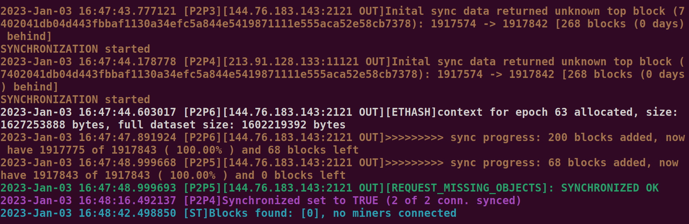
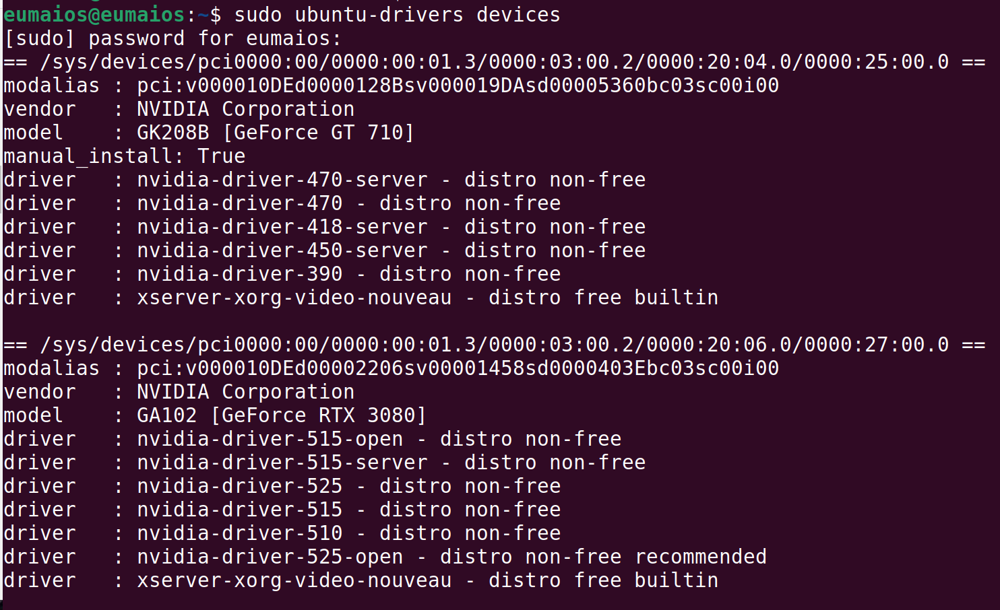
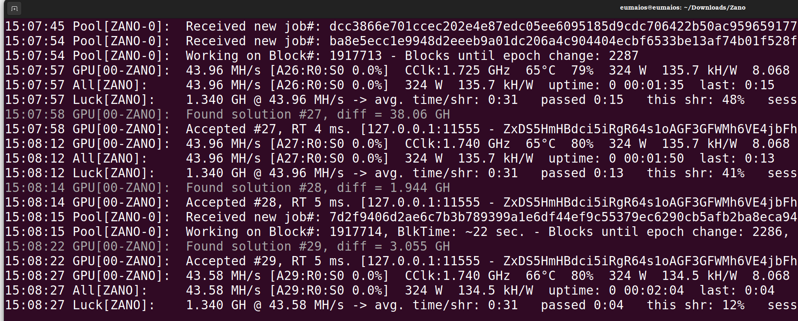
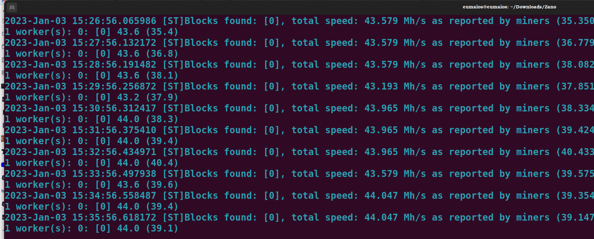

<div>
<div align=center>
<a href="https://freeimage.host/"></a>
<h1>Solo Mining with Nvidia<h1>
</div>

## Step 1: Synchronize the Daemon

Open a terminal in the directory with `zanod`, and run it: [^1]

```
./zanod
```

Allow the daemon to synchronize, while we complete other steps.

## Step 2: Downloading TT-Miner

Open another terminal within the same director, and download TT-Miner application:

```
wget https://github.com/TrailingStop/TT-Miner-release/releases/download/2023.1.0/TT-Miner-2023.1.0.tar.gz
```

Extract the .tar file:

```
tar -xf TT-Miner-2023.1.0.tar.gz
```

Delete the original .tar file:

```
rm TT-Miner-2023.1.0.tar.gz
```

Enter the new TT-Miner directory, and list it's contents (`ls`). Using Nano (or other text editor), open `ZANO-SOLO.sh`:

```
nano ZANO-SOLO.sh
```

Note the contents. They provide the basic instructions for setting up TT-Miner (though they will require slight modifications):

> rem * Your call to start the ZANO stratrum should look like this. You have to replace <YOUR_WALLET_ID>
> rem * with the address of your ZANO-Wallet
> 
> rem zanod.exe --stratum --stratum-miner-address=<YOUR_WALLET_ID> --stratum-bind-port=11555
> 
> rem TT commandline
> ./TT-Miner -luck -coin ZANO -P <YOUR_WORKER_NAME>@127.0.0.1:11555
> pause

Exit Nano (`ctl+x`) and close the terminal.

## Step 3: Flagging your Daemon for Mining

Once your node is fully synced, stop it (`ctl+c`). In the same terminal, restart `zanod`  with the following flags, taken from the above `ZANO-SOLO.sh` file:

```
./zanod --stratum --stratum-miner-address=<YOUR_WALLET_ID> --stratum-bind-port=11555
```

Note the above has two important adjustments:

- You must account for Linux, substituing `zanode.exe` with `./zanod`. 

- You must replace `<YOUR_WALLET_ID>`, with wallet's **receive address** (note this is neither your Rig nor your wallet name).

If you do not place your receive address there, you may get an error such as the following:

<div>
<div align=center>

</div>

<div>
<div align=center>

</div>

But if there are no other problems, the daemon should start and you'll see the following screens:

<div>

</div>

<div>

</div>

<div>

</div>

<div>

</div>

## Step 4: Starting TT-Miner

Leave the daemon running and go back to your open terminal with `ZANO-SOLO.sh` and `TT-Miner` files. 

First, since Ubuntu uses all open source drivers, you may need to install the proper proprietary Nvidia driver (for use with Cuda below). To determine which FOSS driver you may have, and which proprietary driver is recommended, give the command:

```
sudo ubuntu-drivers devices
```

You should see something like the following:

<div>

</div>

If you already have proprietary drivers, you can skip the next three sub-steps.

If you need to upgrade, and wish to go with the suggested driver(s), give:

```
sudo ubuntu-drivers autoinstall
```

You will now need to reboot your system for these changes to be made (remember to stop the daemon running on the other terminal, if so).

Unless you already have Cuda Advanced Libraries installed on your Linux machine, we have one additional installation before running TT-Miner: [^2]

```
sudo apt install nvidia-cuda-toolkit
```

If you wish to check on the installation, give:

```
nvcc --version
```

OK! We're finally ready to run TT-Miner.

Returning to the directory with both `ZANO-SOLO.sh` and `TT-Miner` , open a terminal. 

Give the command: 

```
./TT-Miner -luck -coin ZANO -u miner -o 127.0.0.1:11555
```

Your miner should start, displaying something like this:

<div>

</div>

And if you switch to the terminal with your daemon running, you should now see this:

<div>

</div>

<div>
<div align=center>
<h1>Congratulations, you're now solo mining Zano!<h1>
</div>

[^1]: This guide assumes you've already installed, and can use, a CLI wallet and its daemon. If you haven't, see those guides [here](https://docs.zano.org/docs/install-a-zano-cli-wallet-ubuntu) and [here](https://docs.zano.org/docs/using-a-zano-cli-wallet), respectively.  

[^2]: If you get the following error, you'll need to install Cuda:

./TT-Miner: error while loading shared libraries: libcuda.so.1: cannot open shared object file: No such file or directory.
